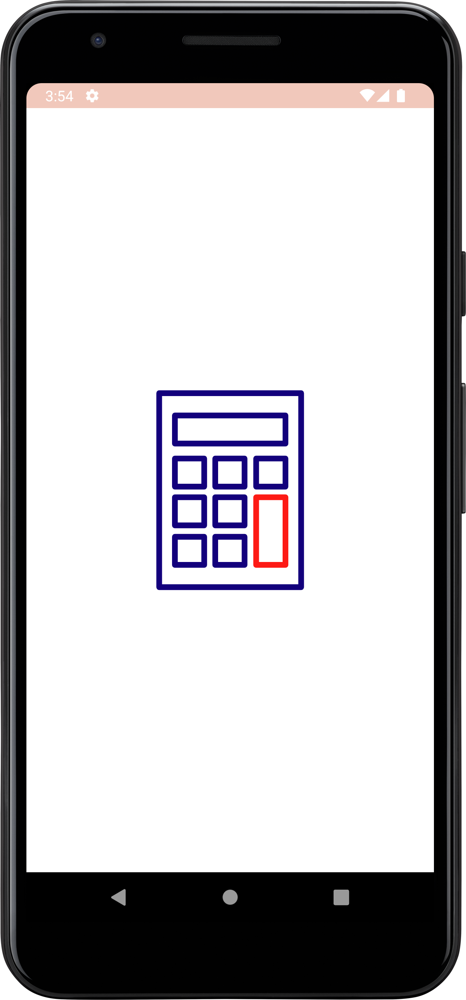
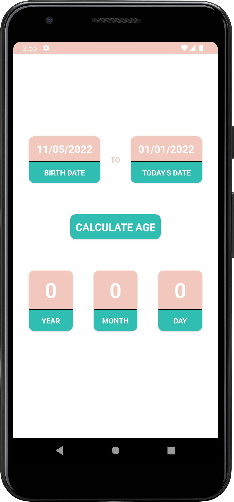
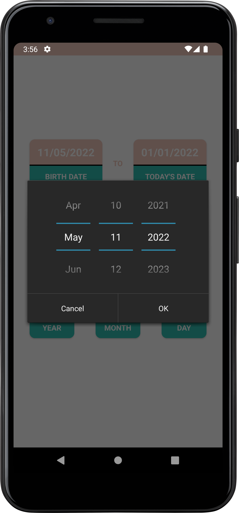
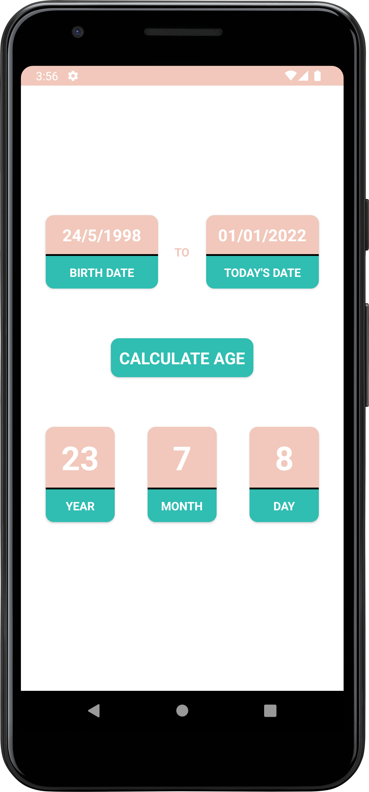
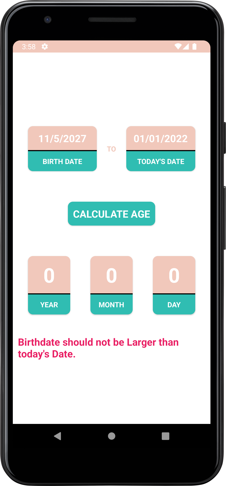

# Age-Calculator
Age Calculator is an Android App to calculate your current age using your birthdate.

### Download App:

Link: https://terabox.com/s/1_wN-wKU_nrJl881m_zzmRg

### Age Calculator App - Android Project (YouTube PlayList):

Link: https://youtube.com/playlist?list=PLDitZ-MAvK-5pi6dvtd4D10YqGh8SvH3c

### ANDROID APP DEVELOPMENT COURSE (BANGLA):
Link: https://cutt.ly/oJxeUxL

### Screenshots:

| Splash Screen      |  Home Screen |  Select Date Screen |
| :---:       |    :----:   | :----:   |
|        |       |    |

| Result Screen      |  Error Screen | 
| :---:       |    :----:   | 
|        |       |

### Disclaimer
This project is made only for educational purpose. Anyone can use it but the risk has to be taken by the user.
for any query please contact me.

### Repository Owner Info

### Md. Al-Amin
##### Junior Software Engineer (Android & iOS) at Rokomari.com

__Email :__ [ alamin.karno@outlook.com ](mailto:alamin.karno@outlook.com)  
__Github :__ [Md. Al-Amin](https://github.com/alamin-karno) 
__Facebook :__ [মোঃ আল-আমিন খন্দকার কর্ণ](https://facebook.com/alamin.kanro786)  
__Linkedin :__ [Md. Alamin Karno](https://www.linkedin.com/in/alaminkarno/)
 
